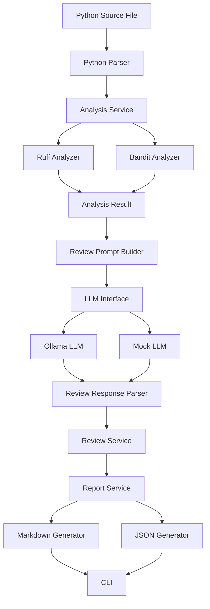
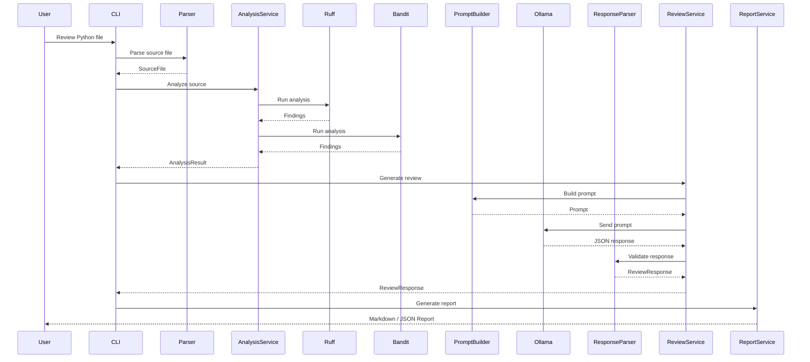

# Code Review Assistant Architecture

## Overview

The Code Review Assistant is an AI-powered software engineering tool that combines deterministic static code analysis with a Large Language Model (LLM) to produce structured, explainable, and actionable code review comments.

Unlike traditional static analyzers, which only report rule violations, this system uses an LLM to explain why an issue matters and recommend practical improvements. Static-analysis findings are used as evidence rather than absolute truth, allowing the AI to generate more contextual reviews while reducing false positives.

The project follows a modular architecture that separates parsing, static analysis, prompt construction, AI interaction, response validation, report generation, and user interaction.

---

# System Architecture



---

# Layered Architecture

The application is organized into logical layers.

```text
+------------------------------------------------+
|              Presentation Layer                |
|------------------------------------------------|
| CLI                                            |
+------------------------------------------------+

+------------------------------------------------+
|              Application Layer                 |
|------------------------------------------------|
| AnalysisService                                |
| ReviewService                                  |
| ReportService                                  |
+------------------------------------------------+

+------------------------------------------------+
|                 Domain Layer                   |
|------------------------------------------------|
| SourceFile                                     |
| Finding                                        |
| AnalysisResult                                 |
| ReviewResponse                                 |
| ReviewComment                                  |
+------------------------------------------------+

+------------------------------------------------+
|             Infrastructure Layer               |
|------------------------------------------------|
| Ruff Analyzer                                  |
| Bandit Analyzer                                |
| Ollama LLM                                     |
| Markdown Generator                             |
| JSON Generator                                 |
+------------------------------------------------+
```

---

# Review Pipeline

The following sequence describes the complete review process.



---

# Component Responsibilities

| Component | Responsibility |
|------------|----------------|
| PythonParser | Validates the source file, verifies Python syntax, counts lines, and creates a SourceFile object. |
| RuffAnalyzer | Detects bugs, style issues, readability problems, and performance improvements. |
| BanditAnalyzer | Detects Python-specific security vulnerabilities. |
| AnalysisService | Executes all analyzers, combines results, and records analyzer failures. |
| ReviewPromptBuilder | Converts source code and findings into a structured prompt for the LLM. |
| BaseLLM | Abstract interface for language model providers. |
| OllamaLLM | Sends prompts to a locally hosted Ollama model. |
| MockLLM | Returns deterministic responses during automated testing. |
| ReviewResponseParser | Validates AI-generated JSON using Pydantic. |
| ReviewService | Coordinates prompt creation, LLM invocation, and response parsing. |
| MarkdownReportGenerator | Produces Markdown reports. |
| JsonReportGenerator | Produces machine-readable JSON reports. |
| ReportService | Chooses the appropriate report generator based on the requested format. |
| ApplicationContainer | Creates and wires all application dependencies. |
| CLI | Accepts user input and coordinates the review workflow. |

---

# Project Directory Structure

```text
app/
│
├── analyzers/
│   ├── bandit_analyzer.py
│   └── ruff_analyzer.py
│
├── bootstrap/
│   └── application_container.py
│
├── cli/
│   └── main.py
│
├── config/
│
├── exceptions/
│
├── llm/
│   ├── base_llm.py
│   ├── mock_llm.py
│   └── ollama_llm.py
│
├── models/
│
├── parser/
│   └── python_parser.py
│
├── prompts/
│   └── review_prompt_builder.py
│
├── reports/
│   ├── markdown_report_generator.py
│   └── json_report_generator.py
│
├── response/
│   └── review_response_parser.py
│
└── services/
    ├── analysis_service.py
    ├── review_service.py
    └── report_service.py
```

---

# Design Decisions

## Why Ruff?

Ruff was selected because:

- Extremely fast
- Modern Python linter
- JSON output
- Supports many Flake8-compatible rules
- Easy integration

---

## Why Bandit?

Bandit specializes in Python security analysis.

Advantages include:

- Detects insecure coding practices
- Structured JSON output
- Complements Ruff instead of replacing it

---

## Why Ollama?

The project prioritizes privacy.

Benefits include:

- Local execution
- No cloud API dependency
- No source code leaves the machine
- No API costs

---

## Why MockLLM?

Automated tests should never depend on an external model.

MockLLM provides:

- Deterministic responses
- Fast tests
- Reliable CI/CD execution

---

## Why Pydantic?

LLM responses are unpredictable.

Pydantic ensures:

- Correct schema
- Required fields
- Type validation
- Clear validation errors

---

## Why Dependency Injection?

Instead of creating dependencies directly inside classes, they are injected through constructors.

Benefits:

- Easier testing
- Easier replacement of implementations
- Loose coupling
- Better maintainability

---

# Internal Data Flow

```text
Source Code
      │
      ▼
Python Parser
      │
      ▼
SourceFile
      │
      ▼
AnalysisService
      │
      ▼
AnalysisResult
      │
      ▼
PromptBuilder
      │
      ▼
Prompt
      │
      ▼
LLM
      │
      ▼
Raw JSON
      │
      ▼
ResponseParser
      │
      ▼
ReviewResponse
      │
      ▼
ReportService
      │
      ▼
Markdown / JSON
```

---

# Error Handling Strategy

The application is designed to fail gracefully.

| Failure | Handling |
|----------|----------|
| Unsupported file type | Parser raises validation error |
| Python syntax error | Parsing stops before analysis |
| File exceeds maximum lines | Validation error |
| Ruff unavailable | Error recorded in AnalysisResult |
| Bandit unavailable | Error recorded in AnalysisResult |
| Invalid analyzer JSON | Analyzer-specific exception |
| Ollama unavailable | Friendly runtime exception |
| LLM timeout | Timeout exception |
| Invalid LLM JSON | Response validation exception |
| Invalid response schema | Pydantic validation error |
| Output file exists | User confirmation or overwrite option |

---

# Security Considerations

Several measures were implemented to improve system safety.

- Source code is treated as untrusted input.
- Prompt instructions explicitly tell the LLM not to execute or follow instructions contained in source code.
- Static-analysis findings are treated as evidence rather than guaranteed defects.
- Responses are validated before report generation.
- Local LLM execution prevents source code from being transmitted to third-party services by default.

---

# Performance Considerations

The system is designed for source files of approximately **500 lines**.

Performance optimizations include:

- Fast static analysis using Ruff
- Parallel analyzer architecture (future enhancement)
- Configurable limit on prompt findings
- Configurable maximum source size
- Efficient Pydantic models
- Lightweight report generation

The performance test validates that parser and static analysis complete within a reasonable execution time on a 500-line file.

---

# Extensibility

The architecture is intentionally modular.

Future extensions include:

- Java support
- JavaScript support
- C/C++ support
- GitHub Pull Request integration
- Repository-wide review
- IDE plugins
- HTML reports
- SARIF reports
- Additional static analyzers
- Multiple LLM providers
- Automatic code fixes

Because each major responsibility is isolated behind well-defined interfaces, these features can be added with minimal changes to the existing system.

---

# Software Engineering Principles

The project follows several established software engineering principles.

- Separation of Concerns
- Single Responsibility Principle (SRP)
- Dependency Inversion Principle (DIP)
- Open/Closed Principle (OCP)
- Composition over Inheritance
- Dependency Injection
- Adapter Pattern
- Interface-based Design
- Graceful Degradation
- Explicit Validation
- Modular Architecture

---

# Conclusion

The Code Review Assistant demonstrates how deterministic static analysis and Large Language Models can be combined to create explainable AI-assisted code reviews.

The architecture emphasizes modularity, maintainability, testability, extensibility, and privacy. By separating concerns into independent components and validating all external interactions, the system provides a solid foundation for future enhancements such as multi-language support, repository-level analysis, IDE integration, and GitHub pull-request reviews.